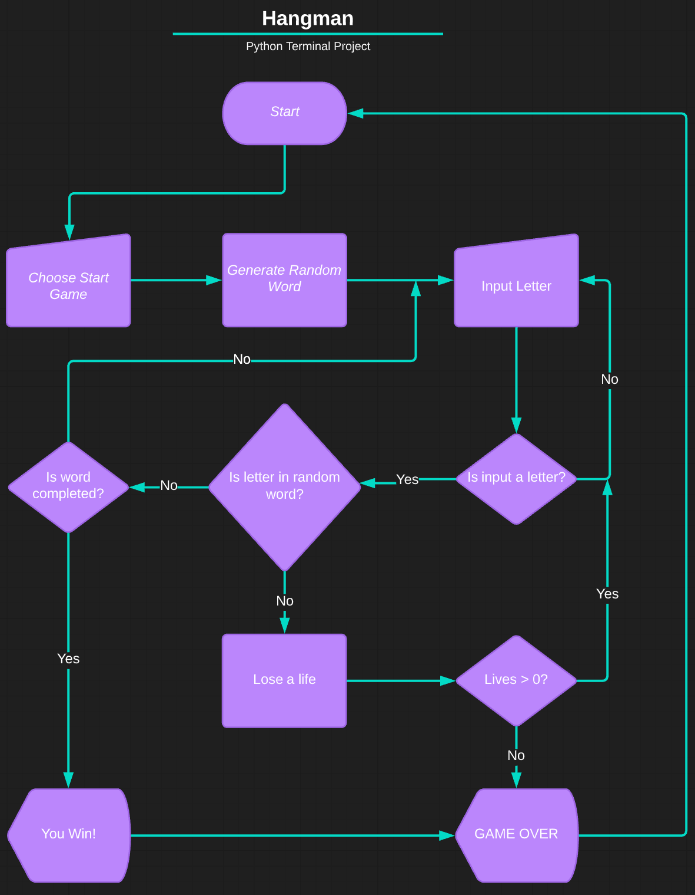
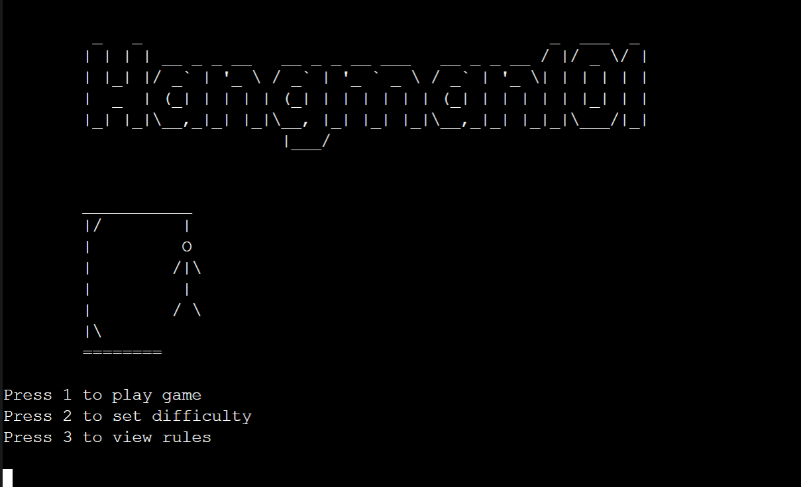
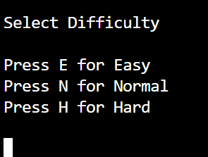
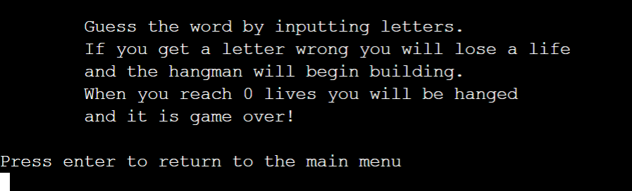
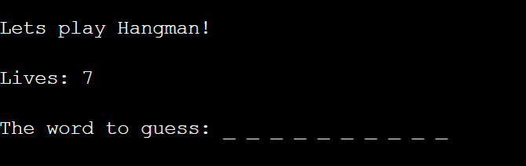
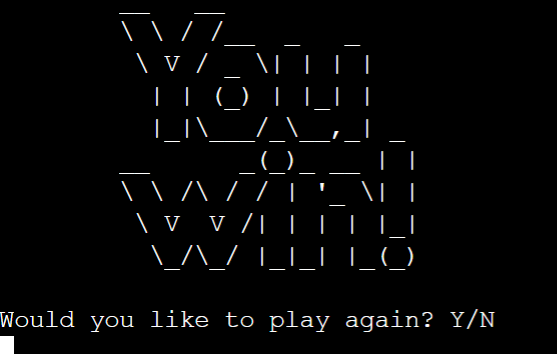
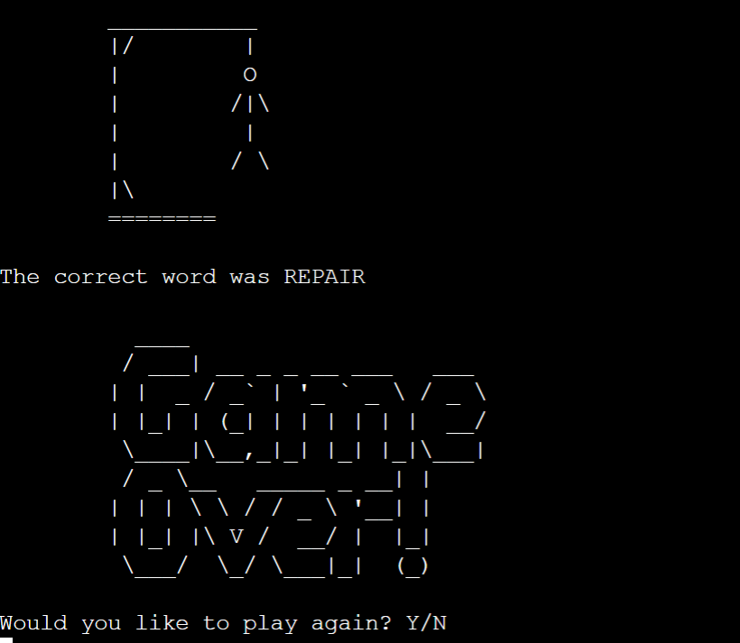
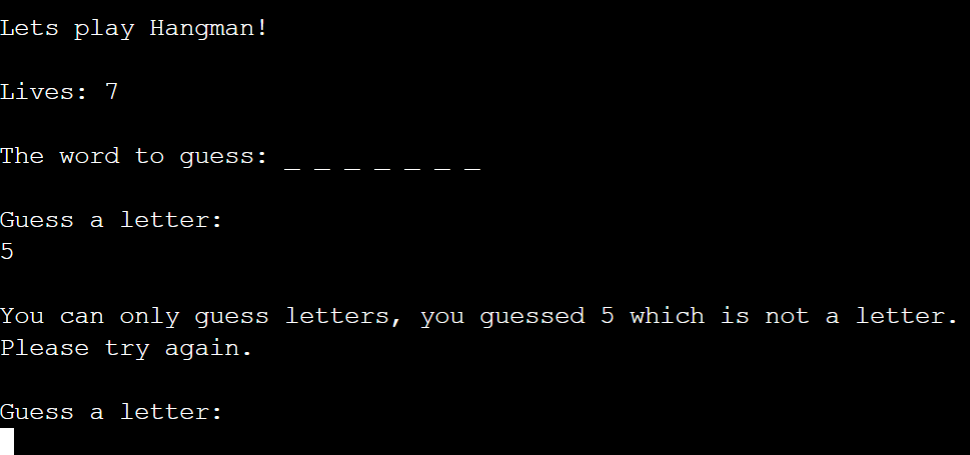

# **Hangman101**
Hangman101 is a Python terminal game, which runs on the Code Institute mock terminal on Heroku.
Users can try to guess the word by inputting letters until they either guess the word or it is game over. 

[Hangman101](https://hangman101.herokuapp.com/) - You can view the live site here. 

 

## **Table of Contents**
 * [**How to Play**](#how-to-play)
 * [**Planning Stage**](#planning-stage)
   * User Goals
   * Using FlowCharts
 * [**Features**](#features)
   * Future Features
 * [**Testing**](#testing)
 * [**Technologies Used**](#technologies-used)
 * [**Bugs**](#bugs)
   * Fixed Bugs
   * Unfixed Bugs
 * [**Validators**](#validators)
 * [**Deployment**](#deployment)
 * [**Credits**](#credits)

## **How to Play**
Players play Hangman101 by inputting commands into the mock terminal. The aim of the game is to guess the hidden word, represented with _ _ _ _ to show players how many letters are in the word. As the player corrrectly guesses letters, the _ are replaced with the correct letter. If a player puts in an incorrect command, an error message displays and the player is asked to resubmit their choice. 
The game is over either when the player has correctly guessed the word or they have run out of lives. 

## **Planning Stage**

### **User Goals**
To build a terminal version of Hangman for a developer to use in an IDE environment whilst taking a break from coding.
 * The game should be easy to play.
 * The game should be fun to play.
 * There should be a level of challenge for the user to keep them coming back.

 ### **Using FlowCharts**
 During the planning process I thought about the basic steps needed to play a game of hangman and drew a basic flowchart to help guide my coding process whilst developing the game. 
  * Where were inputs from the user needed?
  * How would I deal with invalid inputs?
  * How would I deal with incorrect tries?
  * Were there any logic errors that could break the loop of the game?

 

 ## **Features**

 ### **Existing Features**
* Game Menu
  * Can select to start game
  * Can change difficulty
  * Can view how to play the game

* Set Difficulty
  * Easy = 10 lives
  * Normal = 7 lives
  * Hard = 5 lives

* View Game Rules

 * Random word generations
   * A function randomly generates a word from a list of 500 words.
   * The player can not see what the word is but can see how many letters are in the word denoted by _ _ _ _ _ 

 

 * Lives with graphical representation
   * The user has a certain amount of lives before it is game over.
   * This can be seen whilst playing the game.
   * It is also represented by a image of the hangman being built as each life is lost.
   * You can get more lives by changing the difficulty.

 

* Game Over Screens.
 * A custom screen for winning the game and for game over. 
 * Users can choose whether to restart the game or go back to the main menu.

 

 

* Checks for invalid inputs.
  * For all user inputs, checks are run to ensure there are no invalid inputs submitted.
  * For any invalid submissions, a tailored error message is displayed and the user is prompted to input their selection again.

 

## **Future Features**
 * Ability to guess whole words if player thinks they know the answer.
 * Implement a turn timer. On hard mode a player has X amount of seconds to make a turn or they lose a life.
 * Add a scoring system.
 * Implement a true random word generator rather than using a set list. 
   * Generated words would need to be within a certain range, with certain unique / less known words filtered out (except for hard mode, or even create an ultra mode for this).

## **Testing**
I have manually tested the project by doing the following: 
* Tested python code through a PEP8 Linter using (http://pep8online.com/) and fixed any errors.
* Manually tested user inputs by purposefully inputing incorrect data to confirm error messages were capturing wrong inputs.
* Tested in the local terminal and on the mock terminal on the deployed site on Heroku.

## **Technologies Used**
* Languages
  * Python.
* Libraries
  * random to select a random word.
* Other
  * words.txt - A list of randomly generated words to be used to select a word to play, taken from (https://www.randomlists.com/random-words).

## **Bugs**

### **Fixed Bugs**
* Bug: When implementing hangman graphics, lives left did not correspond to amount of stages left in hangman.
  * Fix: Due to lists iterating from 0, set lives displayed to user as lives + 1 and also adjusted the game over setting for lives >=0
* Bug: When testing hangman graphics, the bottom graphic was shifted over to the right.
  * Fix: Replaced \ with double \\\\ make \ print to the terminal. 
* Bug: When on last life, letters guessed and amount of lives fail to show on terminal.
  * Fix: Set lives to lives >=0 at end of while loop to ensure messages display correctly.
* Bug: Hangman graphic not displaying on game over.
  * Fix: Add in additional stage of hangman graphic. Remove lives + 1 from script, set game over criteria back lives > 0. A more elgant fix for the problem above.
* Bug: When selecting view rules. After returning to the main window, if you selected play game it would go to the difficulty menu
  * Fix: Called main() in game rules rather that initialise_game()
* Bug: Error message too long causing last letter to wrap to following line.
  * Fix: Split up error string and put "Please try again" to a new line.

### **Unfixed Bugs**
* None currently known.

## **Validators**
* PEP8
  * No errors returned from (http://pep8online.com/).

## **Deployment**
The project was deployed using Code Institutes mock terminal for Heroku. 

* Steps to deploy:
  * Fork or clone this repository.
  * Create a new app in [Heroku](https://dashboard.heroku.com/apps).
  * Select "New" and "Create new app".
  * Name the new app and click "Create new app".
  * In "Settings" select "BuildPack" and select Python and Node.js. (Python must be at the top of the list).
  * Whilst still in "Settings", click "Reveal Config Vars" and input the folloing. KEY: PORT, VALUE: 8000. Nothing else is needed here as this project does not have any sensitive files.
  * Click on "Deploy" and select your deploy method and repository.
  * Click "Connect" on selected repository. 
  * Either choose "Enable Automatic Deploys" or "Deploy Branch" in the manual deploy section. 
  * Heroku will now deploy the site.

## **Credits**
 * [Code Institute](https://codeinstitute.net/) for the mock terminal for the deploy to a live site.
 * [Random Word Generator](https://www.randomlists.com/random-words) - to generate a random list of 500 words for the game.
 * [Python Hang Man tutorial](https://github.com/kiteco/python-youtube-code/tree/master/build-hangman-in-python) - inspiration on how to build a hang man game. Whilst I have attempted to do my own thing, and greatly expand on the initial example, some code may be similar. 
 * [ASCII Art Generator](https://patorjk.com/software/taag/#p=display&f=Standard&t=Hangman101) - for creating word art for game title and game over screens.